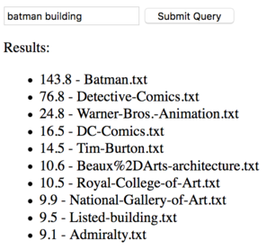

# tinysearch

This repository contains a tiny search engine, in just
[140 lines of Python](https://github.com/jorendorff/tinysearch/blob/master/tiny.py).
Originally written for PyTennessee 2017.

## The challenge

**Change this search engine to recognize *exact phrases*
and boost them up to the top of the search results.**

Explanation: If you run this search engine and search for `hot chicken`,
you'll get this:

And if you search for `batman building`, you'll get this:

We want to see `Nashville%2C-Tennessee.txt` at the top of both queries.

The information you need to do this is already in the index.

## How to run this search engine

1.  clone this repository

2.  download either
    [sample.tar.bz2](https://www.dropbox.com/s/uk5ns6u597z1rwp/sample.tar.bz2?dl=1)
    or
    [sample.zip](https://www.dropbox.com/s/cn6n2xjjyyz3c13/sample.zip?dl=1)
    and untar/unzip it in your `tinysearch` directory.

3.  `python3 tiny.py small-sample`
    to create a search index!

    ([get Python 3 here](https://www.python.org/downloads/))

4.  `pip install flask`

5.  `FLASK_DEBUG=1 FLASK_APP=web.py flask run`
    to start the web server!

Then you can go to <http://localhost:5000/> to see the toy search engine.

## How to switch to the large sample

The instructions above only search 50 files.
To search all 8,000+ files, make these two changes:

1.  `python3 tiny.py large-sample`
    to create the index. This takes ~5 minutes.

2.  In `web.py`, just change the string `"small-sample"` to `"large-sample"`.
    (When you save that file, Flask will notice
    and automatically restart your web server.)

